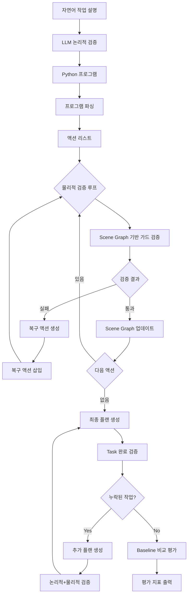

# 파이프라인 시각화 제안

## 옵션 1: 단계별 흐름도 (논문용 - 가장 추천)

```
┌─────────────────────────────────────────────────────────────────────────┐
│                        논리적 검증 (Logical Verification)                 │
│                                                                         │
│  자연어 작업 설명                                                          │
│      ↓                                                                  │
│  LLM (Ollama llama3)                                                    │
│      ↓                                                                  │
│  Python 프로그램 생성                                                      │
└─────────────────────────────────────────────────────────────────────────┘
                              ↓
┌─────────────────────────────────────────────────────────────────────────┐
│                    프로그램 파싱 (Program Parsing)                         │
│                                                                         │
│  Python 코드 → 액션 리스트 변환                                             │
│  [GoToObject, PickupObject, PutObject, ...]                             │
└─────────────────────────────────────────────────────────────────────────┘
                              ↓
┌─────────────────────────────────────────────────────────────────────────┐
│              물리적 검증 루프 (Physical Verification Loop)                 │
│                                                                         │
│  For each action in plan:                                               │
│    ┌──────────────────────────────────────────────────────────────┐     │
│    │  Scene Graph 기반 가드 검증                                     │     │
│    │  - EXISTS, Proximity, REACHABLE, HOLDS,                      │     │
│    │    OPENED, PICKUPABLE, NAVIGABLE, ...                        │     │
│    └──────────────────────────────────────────────────────────────┘     │
│                        ↓                    ↓                           │
│                        [통과]              [실패]                         │
│                        ↓                    ↓                           │
│            ┌──────────────────┐   ┌──────────────────────┐              │
│            │ Scene Graph      │   │ 복구 액션 생성          │              │
│            │ 업데이트           │   │ - GoToObject         │              │
│            │                  │   │ - PickupObject       │              │
│            │                  │   │ - OpenObject         │              │
│            │                  │   │ - CloseObject        │              │
│            └──────────────────┘   └──────────────────────┘              │
│                        ↓                    ↓                           │
│                    [다음 액션]          [복구 액션 삽입]                     │
│                                                                         │
│  검증 종료 조건:                                                           │
│  - EXISTS 실패 → 즉시 종료                                                 │
│  - REACHABLE 실패 → 즉시 종료                                              │
└─────────────────────────────────────────────────────────────────────────┘
                              ↓
┌─────────────────────────────────────────────────────────────────────────┐
│                  최종 플랜 생성 (Final Plan Generation)                    │
│                                                                         │
│  - 통과한 액션: 실행 가능 코드                                               │
│  - 실패한 액션: 주석처리 + LLM 주석                                          │
│  - 복구 액션: [시스템 생성] 마커                                             │
│  - 원본 액션: [LLM 생성 - 논리적 검증] 마커                                   │
└─────────────────────────────────────────────────────────────────────────┘
                              ↓
┌─────────────────────────────────────────────────────────────────────────┐
│            Task 완료 검증 (Task Completion Verification)                  │
│                                                                         │
│  LLM을 사용하여 자연어 목표와 최종 플랜 비교                                    │
│      ↓                                                                  │
│  [누락된 작업 발견?]                                                       │
│      ↓                    ↓                                             │
│    [Yes]                [No]                                            │
│      ↓                    ↓                                             │
│  누락된 작업에 대한      최종 플랜 반환                                        │
│  플랜 생성 (논리적+물리적 검증)                                               │
│      ↓                                                                  │
│  기존 플랜에 추가                                                          │
└─────────────────────────────────────────────────────────────────────────┘
                              ↓
┌─────────────────────────────────────────────────────────────────────────┐
│              Baseline 비교 평가 (Baseline Comparison)                    │
│                                                                         │
│  Baseline(ProgPrompt) 실행                                              │
│      ↓                                                                  │
│  평가 지표 계산:                                                         │
│  - Task Success Rate                                                    │
│  - Action Pass Rate                                                    │
│  - Recovery Action Effectiveness                                       │
│  - Plan Executability                                                 │
│  - Scene Graph 비교 (IN 엣지, heldObjectId)                            │
└─────────────────────────────────────────────────────────────────────────┘
```

## 옵션 2: 컴포넌트 중심 다이어그램

```
┌──────────────┐
│   자연어      │
│   작업 설명    │
└──────┬───────┘
       │
       ▼
┌─────────────────────────────────────────────────────────────┐
│                    논리적 검증 모듈                            │
│  ┌──────────────────────────────────────────────────────┐   │
│  │  LLM (Ollama llama3)                                 │   │
│  │  - ProgPrompt 스타일 프롬프트                           │   │
│  │  - Python 프로그램 생성                                 │   │
│  └──────────────────────────────────────────────────────┘   │
└─────────────────────────────────────────────────────────────┘
       │
       ▼
┌─────────────────────────────────────────────────────────────┐
│                    파싱 모듈                                  │
│  ┌──────────────────────────────────────────────────────┐   │
│  │  parse_program_to_actions()                          │   │
│  │  Python 코드 → 액션 리스트                              │   │
│  └──────────────────────────────────────────────────────┘   │
└─────────────────────────────────────────────────────────────┘
       │
       ▼
┌─────────────────────────────────────────────────────────────┐
│              물리적 검증 모듈 (Scene Graph 기반)                │
│  ┌──────────────────────────────────────────────────────┐   │
│  │  Scene Graph                                         │   │
│  │  - Agent 상태                                         │   │
│  │  - Object 속성                                        │   │
│  │  - Edge 관계                                          │   │
│  └──────────────────────────────────────────────────────┘   │
│  ┌──────────────────────────────────────────────────────┐   │
│  │  가드 검증 엔진                                         │   │
│  │  - EXISTS, Proximity, REACHABLE, HOLDS, ...          │   │
│  └──────────────────────────────────────────────────────┘   │
│  ┌──────────────────────────────────────────────────────┐   │
│  │  복구 액션 생성기                                       │   │
│  │  - GoToObject, PickupObject, OpenObject, ...         │   │
│  └──────────────────────────────────────────────────────┘   │
│  ┌──────────────────────────────────────────────────────┐   │
│  │  Scene Graph 업데이트                                  │   │
│  │  - 상태 변경 추적                                       │   │
│  └──────────────────────────────────────────────────────┘   │
└─────────────────────────────────────────────────────────────┘
       │
       ▼
┌─────────────────────────────────────────────────────────────┐
│              Task 완료 검증 모듈                               │
│  ┌──────────────────────────────────────────────────────┐   │
│  │  LLM (Ollama llama3)                                 │   │
│  │  - 자연어 목표 vs 최종 플랜 비교                          │   │
│  │  - 누락된 작업 식별                                     │   │
│  └──────────────────────────────────────────────────────┘   │
└─────────────────────────────────────────────────────────────┘
       │
       ▼
┌─────────────────────────────────────────────────────────────┐
│              평가 모듈                                        │
│  ┌──────────────────────────────────────────────────────┐   │
│  │  Baseline 비교                                        │   │
│  │  - Task Success Rate                                 │   │
│  │  - Action Pass Rate                                  │   │
│  │  - Recovery Action Effectiveness                     │   │
│  │  - Plan Executability                                │   │
│  │  - Scene Graph 비교                                   │   │
│  └──────────────────────────────────────────────────────┘   │
└─────────────────────────────────────────────────────────────┘
```

## 옵션 3: 상세 가드 검증 흐름도

```
액션 입력
    ↓
┌─────────────────────────────────────────────────────────────┐
│  가드 검증 순서                                                │
│                                                             │
│  1. EXISTS(object) ──┐                                      │
│                      │ 실패 → 검증 종료                        │
│                      ↓ 통과                                  │
│  2. Proximity(agent, object) ──┐                            │
│                                 │ 실패 → GoToObject 추가      │
│                                 ↓ 통과                       │
│  3. REACHABLE(agent, object) ──┐                            │
│                                  │ 실패 → 검증 종료            │
│                                  ↓ 통과                      │
│  4. 액션별 특화 가드:                                          │
│     - PickupObject: pickupable, ¬HOLDS, ¬IN(...)            │
│     - PutObject: HOLDS, receptacle, OPENED                  │
│     - OpenObject: openable, ¬OPENED                         │
│     - SliceObject: sliceable, HOLDS('Knife'), ¬isSliced     │
│     - ...                                                   │
│                                  │                          │
│                                  ↓                          │
│  [모든 가드 통과]                                              │
└─────────────────────────────────────────────────────────────┘
    ↓
Scene Graph 업데이트
    ↓
다음 액션
```

## 옵션 4: 데이터 흐름 다이어그램

```
┌─────────────────┐
│  Scene Graph    │ ───┐
│  (초기 상태)     │    │
└─────────────────┘    │
                       │
                       ▼
┌──────────────────────────────────────────────────────────┐
│  논리적 검증                                              │
│  입력: 자연어 작업                                         │
│  출력: Python 프로그램                                    │
└──────────────────────────────────────────────────────────┘
                       │
                       ▼
┌──────────────────────────────────────────────────────────┐
│  파싱                                                      │
│  입력: Python 프로그램                                    │
│  출력: 액션 리스트 [A1, A2, A3, ...]                      │
└──────────────────────────────────────────────────────────┘
                       │
                       ▼
┌──────────────────────────────────────────────────────────┐
│  물리적 검증 루프                                           │
│  ┌────────────────────────────────────────────────────┐  │
│  │  For each action:                                  │  │
│  │    Scene Graph ──→ 가드 검증 ──→ 결과                 │  │
│  │         ↑                              ↓           │  │
│  │         │                        [통과] [실패]       │  │
│  │         │                            │     │       │  │
│  │         │                            │     └─→ 복구 │  │
│  │         └────── Scene Graph 업데이트 ──────┘         │  │
│  └────────────────────────────────────────────────────┘  │ 
└──────────────────────────────────────────────────────────┘
                       │
                       ▼
┌──────────────────────────────────────────────────────────┐
│  최종 플랜                                                 │
│  - 통과한 액션 (실행 가능)                                 │
│  - 실패한 액션 (주석처리)                                  │
│  - 복구 액션 (시스템 생성)                                 │
└──────────────────────────────────────────────────────────┘
                       │
                       ▼
┌──────────────────────────────────────────────────────────┐
│  Task 완료 검증                                            │
│  LLM: 자연어 목표 vs 최종 플랜 비교                           │
│  ┌────────────────────────────────────────────────────┐  │
│  │  누락된 작업 발견?                                     │  │
│  │  Yes → 추가 플랜 생성 (논리적+물리적 검증)                │  │
│  │  No → 최종 플랜 반환                                  │  │
│  └────────────────────────────────────────────────────┘  │
└──────────────────────────────────────────────────────────┘
                       │
                       ▼
┌──────────────────────────────────────────────────────────┐
│  평가                                                     │
│  Baseline vs Physical Guard 비교                          │
│  - 평가 지표 계산                                           │
│  - Scene Graph 비교                                       │
└──────────────────────────────────────────────────────────┘
```

## 추천 시각화 방법

### 논문용 (가장 추천)
**옵션 1: 단계별 흐름도**를 사용하되, 다음 요소를 추가:
- 각 단계에 입력/출력 데이터 명시
- Scene Graph 업데이트를 명확히 표시
- 복구 액션 생성 로직을 별도 박스로 표시
- 색상 구분:
  - 파란색: 논리적 검증 (LLM)
  - 초록색: 물리적 검증 (Scene Graph)
  - 주황색: 복구 액션 생성
  - 빨간색: 검증 종료 조건

### 프레젠테이션용
**옵션 2: 컴포넌트 중심 다이어그램**을 사용하여 각 모듈의 역할을 명확히 표시

### 상세 설명용
**옵션 3: 상세 가드 검증 흐름도**를 별도 그림으로 추가하여 가드 검증 로직을 상세히 설명

## 구현 도구 추천

1. **LaTeX (논문용)**: `tikz` 또는 `pgfplots` 패키지 사용
2. **Draw.io / Lucidchart**: 웹 기반 다이어그램 도구
3. **Mermaid**: 마크다운 기반 다이어그램 (GitHub 지원)
4. **PowerPoint / Keynote**: 프레젠테이션용

## Mermaid 코드 예시



